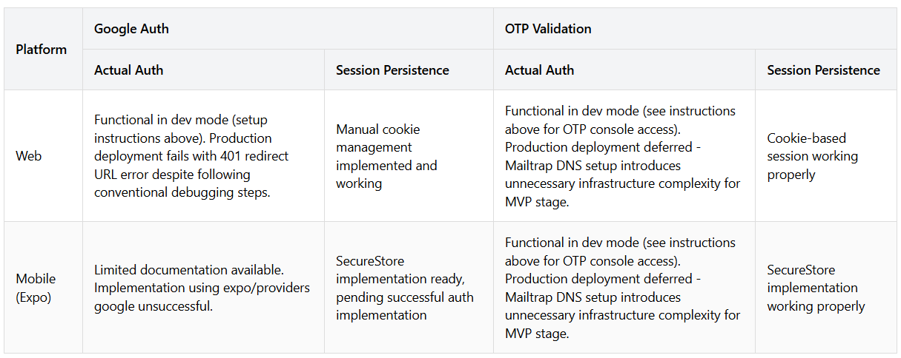

DISCLAIMER:
This game (Trimatch) is a portfolio project implementation inspired by SET®, which is owned and copyrighted by Set Enterprises, Inc. This is a non-commercial, educational project with no monetization (no ads, no in-app purchases). While the game mechanics and styling closely follow the original SET® game, it's created solely for demonstrating programming capabilities in my portfolio. The project maintains a deliberately limited user base and is not being advertised or distributed commercially.
If you are the rights holder and have any concerns, please contact me at lotanbar3@gmail.com.

Hey there! 👋 Trimatch is a pattern-matching puzzle where you spot unique combinations of shapes and colors. Feel free to clone the repo or access it at [https://trimatch.surge.sh](https://trimatch.surge.sh) and give it a try - further info below!

# TriMatch - Full Stack Memory Game
Live Demo: [https://trimatch.surge.sh]
Explore the game's features in this full-stack implementation. All features are now accessible.

## Features
✅ Full responsive UI/UX design
✅ Game core mechanics & logic
✅ Real-time game updates
✅ Error handling & logging
✅ Mobile (Expo) & Web (Vue) support
🚧 Camera-based SET detection with AI (coming soon)
🚧 Multiplayer rooms (coming soon)
❌ Google Auth/ Email OTP (dev environment only)

## Quick Start
1. Clone repository: `git clone https://github.com/allhailalona/trimatch.git`
2. Install dependencies: `npm install`
3. Set up environment variables: 

```bash
# Redis Config (WSL required)
REDIS_URL="redis://127.0.0.1:6379"
REDIS_SESSION_SECRET="your_session_secret"

# MongoDB
MONGODB_URI="your_mongodb_connection_string"

# Google OAuth 2.0
GOOGLE_CLIENT_ID="your_client_id.apps.googleusercontent.com"
GOOGLE_CLIENT_SECRET="your_client_secret"


Notes: 
- Several authentication paths are pending additional infrastructure setup. See current implementation status below:


- Current OTP implementation uses WebSocket for development. Post-MVP production release would integrate WSS (WebSocket Secure) protocol.

