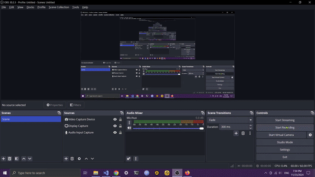

  
  
  
  
  
  
  

 

DISCLAIMER:
This game (Trimatch) is a portfolio project implementation inspired by SET®, which is owned and copyrighted by Set Enterprises, Inc. This is a non-commercial, educational project with no monetization (no ads, no in-app purchases). While the game mechanics and styling closely follow the original SET® game, it's created solely for demonstrating programming capabilities in my portfolio. The project maintains a deliberately limited user base and is not being advertised or distributed commercially.
If you are the rights holder and have any concerns, please contact me at lotanbar3@gmail.com.

  

# TriMatch - Full Stack Memory Game
Hey there! 👋 Trimatch is a pattern-matching puzzle where you spot unique combinations of shapes and colors. Explore the game's features in this full-stack implementation

***
The app is live in https://trimatch.surge.sh
***
***
Download APK at https://drive.google.com/uc?export=download&id=1fhaajKuhlFWrvcqhzrPFiZKUYKAc-7Tb
***
***
🔨 Looking for contributors. Check open issues below or create a new one. Contact me at lotanbar3@gmail.com 🔨
***

## Features
✅ Full responsive UI/UX design
✅ Game core mechanics & logic
✅ Real-time game updates
✅ Error handling & logging
✅ Mobile (Expo) & Web (Vue) support
🚧 Camera-based SET detection with AI (coming soon)
🚧 Multiplayer rooms (coming soon)

APK is currently unavailable, Expo version can be accessed via an android emulator with Expo Go

## Future Enhancements:
  - 🔍 Custom Express Request Types: Incomplete integration with middleware. Will finalize for type safety and cleaner API handling.
  - 🎨 Proper responsiveness for Vue web version AND for mobile phones - requires a lot of manual work 
  - ⚠️ Security vulnerability: Stats validation relies on front-end state instead of server-side validation
  - 🔧 Inconsistent state management: Mixed usage of Pinia and provide/inject patterns should be consolidated
  - ⏱️ Timer/Stopwatch in Active Board: UX-related issue. Not prioritized due to time and energy constraints.

## Production mode limitations -  Fully functional in Development mode
  - 🔒 Google Auth redirect URIs not properly configured in Google Cloud Console
  - 📧 Email OTP service pending due to email provider cost constraints
  - 🛠️ Build Config: eas-cli entry point issue. Needs config fixes.

