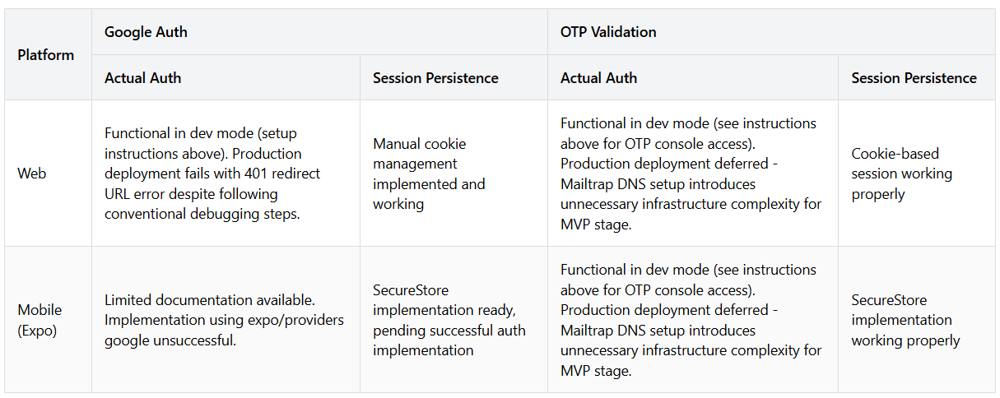

DISCLAIMER:
This game (Trimatch) is a portfolio project implementation inspired by SET®, which is owned and copyrighted by Set Enterprises, Inc. This is a non-commercial, educational project with no monetization (no ads, no in-app purchases). While the game mechanics and styling closely follow the original SET® game, it's created solely for demonstrating programming capabilities in my portfolio. The project maintains a deliberately limited user base and is not being advertised or distributed commercially.
If you are the rights holder and have any concerns, please contact me at lotanbar3@gmail.com.


# TriMatch - Full Stack Memory Game
Hey there! 👋 Trimatch is a pattern-matching puzzle where you spot unique combinations of shapes and colors. Explore the game's features in this full-stack implementation.

A live demo is currently under construction and will soon be up, as well as a valid link to an apk file. 

UNTIL THEN, THE APP IS ONLY FUNCTIONAL IN LOCAL!

## Features
✅ Full responsive UI/UX design
✅ Game core mechanics & logic
✅ Real-time game updates
✅ Error handling & logging
✅ Mobile (Expo) & Web (Vue) support
🚧 Camera-based SET detection with AI (coming soon)
🚧 Multiplayer rooms (coming soon)
❌ Google Auth/ Email OTP (dev environment only)

## Quick Start
1. Clone repository: `git clone https://github.com/allhailalona/SetTheGame.git`
2. Install dependencies: `npm install`
3. Set up environment variables: 

```bash
# Redis Config (WSL required)
REDIS_URL="redis://127.0.0.1:6379"
REDIS_SESSION_SECRET="your_session_secret"

# MongoDB
MONGODB_URI="your_mongodb_connection_string"

# Google OAuth 2.0
GOOGLE_CLIENT_ID="your_client_id.apps.googleusercontent.com"
GOOGLE_CLIENT_SECRET="your_client_secret"


Notes: 
- Several authentication paths are pending additional infrastructure setup. See current implementation status below:


- The score synchronization relies on client-side state data rather than server-side Redis values, making it vulnerable to client-side    manipulation. This could be fixed by using Redis as the source of truth for game statistics during sync operations. For now sets shown in total sets found during game are very much insecure and simply are a state from context. This is due to time contraints.
- Current OTP implementation uses WebSocket for development. Post-MVP production release would integrate WSS (WebSocket Secure) protocol.

